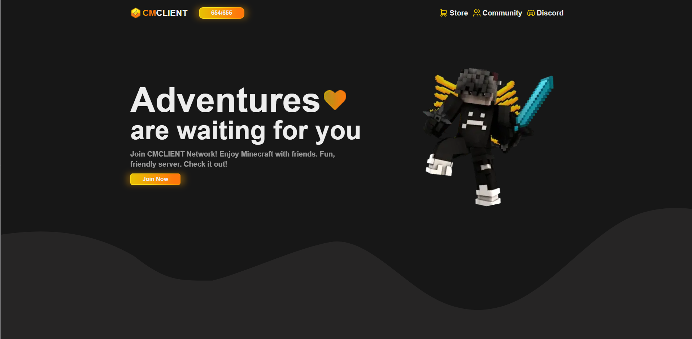
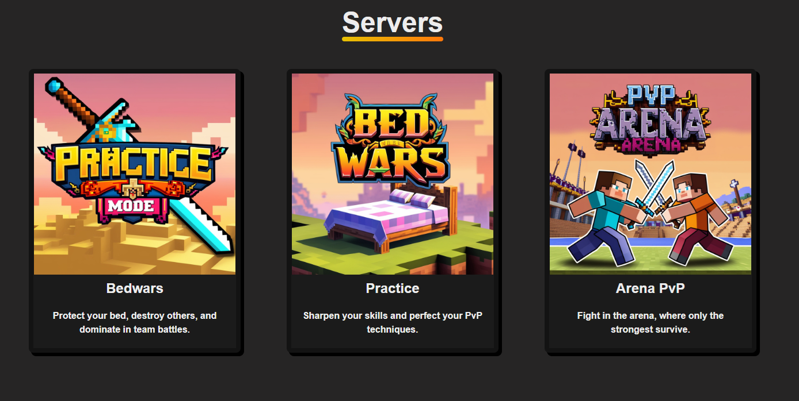
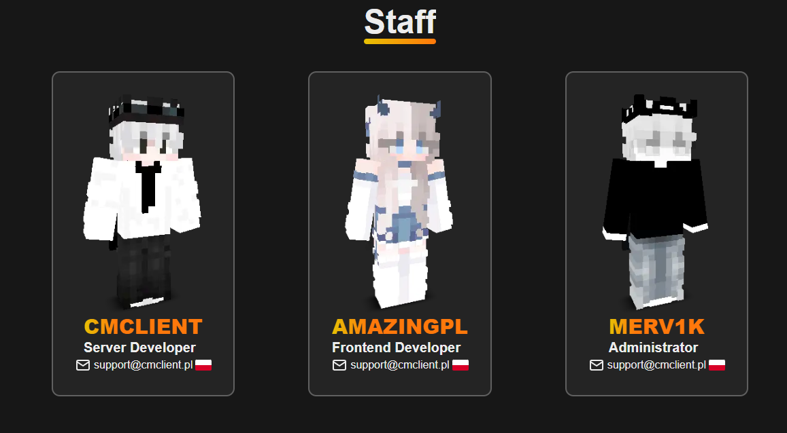

# 🛡️ CMCLIENT Server Webiste
This project is a modern, responsive web application built for a Minecraft server with multiple game modes. Built using React, Tailwind CSS, and Next.js, the website features a real-time player count, an overview of available game modes like Survival, Practice, and Arena PvP, and a dedicated section for showcasing server administrators.

## 🚀 Features

- Live Player Count – Instantly displays the current number of players online, updated in real time.
- Game Mode Section – Highlights all major server modes such as Survival, Practice, and Arena PvP, each with its own description and icon.
- Staff Section – A clean and modern section to showcase the server's staff and admins, complete with avatars and roles.
- Responsive Design – Fully optimized for desktop, tablet, and mobile devices.
- Smooth UI – Built with Tailwind and React to deliver elegant animations and a snappy user experience.

    
    

##ℹ️ FAQ

### How is the player count updated?
The live player counter uses a third-party public API to fetch the current number of players online and updates automatically without needing a page refresh.

### Can I view all available game modes?
The homepage includes clickable sections for each game mode (e.g., Survival, Practice, Arena PvP). While they don't lead to dedicated subpages, they can serve as links to external resources like the item shop or Discord.

### Who manages the server?
You can find all current staff members in the Admin section, complete with their roles and profile images.

### Is it mobile-friendly?
Absolutely. The layout adapts seamlessly to all screen sizes for a smooth experience on any device.
